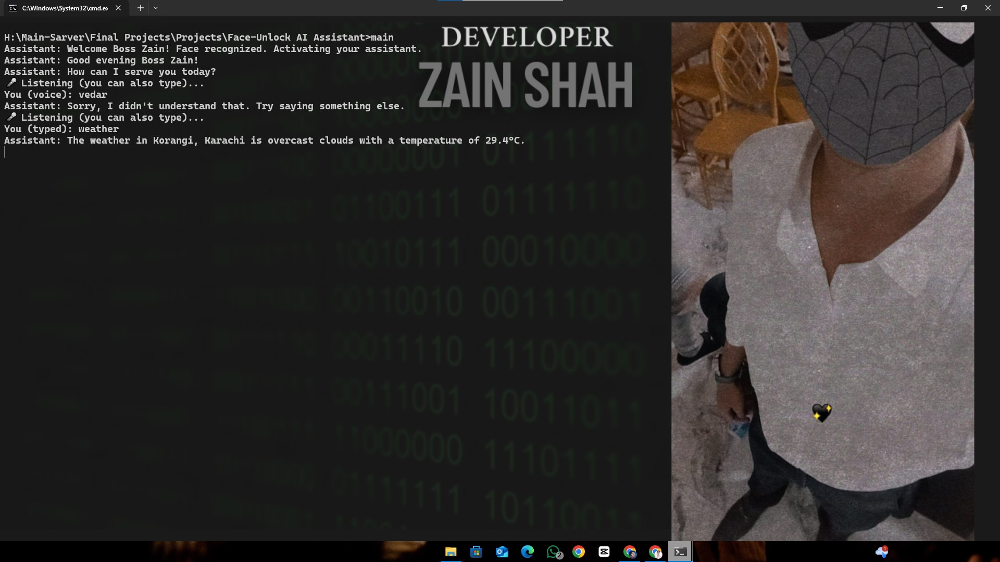

# 🔐 Face-Unlock AI Assistant

A smart desktop assistant that unlocks only when it sees Zain's face using OpenCV's face recognition system. Once authenticated, the assistant provides voice and text command support for a wide variety of tasks — from telling the weather to playing music, locking the screen, telling jokes, and more.

---

## 🧠 Features

- 👤 **Owner-only Access via Face Recognition**
- 🎙️ Voice and Text Command Interaction
- 🌤️ Real-time Weather Updates (via OpenWeatherMap API)
- 📸 Take Screenshots with a Command
- 🔒 Lock your PC with "Lock screen" voice command
- 🖥️ Open apps like Notepad, CMD, YouTube, Instagram, Google, etc.
- 🧑‍💻 Coding, Fitness, Gaming & Study Tips
- 😂 Built-in Jokes and Motivational Quotes
- 🗣️ Voice Feedback using `pyttsx3` (soft female voice)

---

## 🛠️ Tech Stack

- Python 3
- OpenCV (`cv2`)
- pyttsx3 (offline TTS)
- SpeechRecognition + Google Speech API
- PyAutoGUI
- Weather API: [OpenWeatherMap](https://openweathermap.org)
- C++ (for launcher)

---

## 📂 File Structure

face-unlock-ai-assistant/
├── face_unlock_assistant.py # Main assistant script
├── train_face.py # One-time face training script
├── trainer.yml # Trained face model
├── main.cpp # C++ launcher

---

## 🖥️ How to Run

### 🔧 Requirements
- Windows
- Python 3.x
- Required libraries:
  ```bash
  pip install opencv-python pyttsx3 SpeechRecognition pyautogui requests
👣 Step-by-Step
Train Your Face (Only Once):

bash
Copy
Edit
python train_face.py
Run the Assistant (Python way):

bash
Copy
Edit
python face_unlock_assistant.py
OR Launch via C++:

bash
Copy
Edit
g++ main.cpp -o unlocker
unlocker
🎤 Sample Commands
🔑 Command	🧠 Action
"what's the weather"	Speaks current weather of your city
"take screenshot"	Saves screenshot with timestamp
"lock screen"	Instantly locks the computer
"open google"	Launches Google in browser
"play favourite"	Opens a favorite YouTube song
"tell me a joke"	Replies with a joke
"exit" or "bye"	Exits the assistant

👨‍💻 Author
Syed Zain Ali Shah
GitHub Profile

## 📸 Screenshots



📝 License
This project is licensed under the MIT License.
