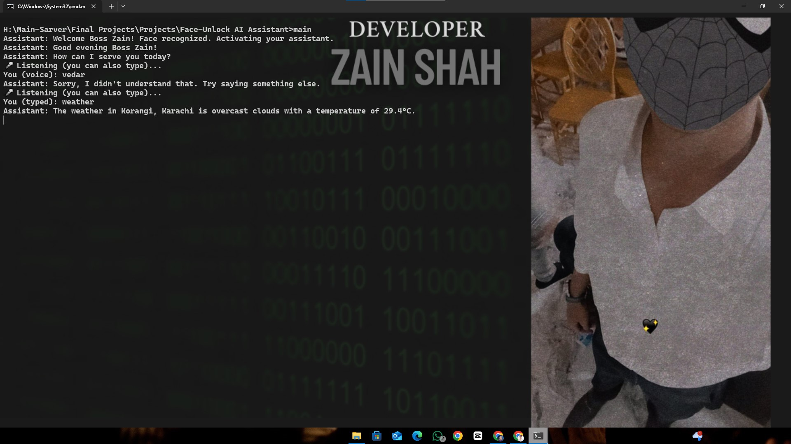

# 🔐 Face‑Unlock AI Assistant


A desktop assistant that unlocks **only for the owner** using facial recognition. After authentication, you can control your PC with voice or text commands – weather, apps, jokes, screen lock, and more.



---

## 🧠 Features

- 👤 **Face‑based Owner Authentication** – OpenCV face recognition
- 🎙️ **Voice Commands** – Speak naturally; assistant responds with speech
- ⌨️ **Text Commands** – Fall back to typing when needed
- 🌤️ **Live Weather** – Fetches from OpenWeatherMap API
- 🔒 **System Control** – Lock screen, take screenshots
- 🖥️ **Application Launcher** – Open Notepad, CMD, browser, etc.
- 😂 **Jokes & Motivation** – Built‑in humour and tips
- 🗣️ **Offline TTS** – `pyttsx3` for clear, soft female voice

---

## 🛠️ Tech Stack

- **Python 3** – main logic
- **OpenCV** (`cv2`) – face detection & recognition
- **pyttsx3** – offline text‑to‑speech
- **SpeechRecognition** + Google Speech API
- **PyAutoGUI** – screenshot & system control
- **OpenWeatherMap** – real‑time weather data
- **C++** – optional launcher

---

## 📂 File Structure
```
face-unlock-ai-assistant/
├── face_unlock_assistant.py # Main assistant
├── train_face.py # One‑time face training
├── trainer.yml # Trained model
├── main.cpp # C++ launcher
└── README.md
```

---

## 🚀 Setup & Run

### 1. Install dependencies:
```bash
pip install opencv-python pyttsx3 SpeechRecognition pyautogui requests
```
### 2. Train your face (only once):
```
python train_face.py
```
### 3. Launch assistant:
```
python face_unlock_assistant.py
```
*(Optional: compile C++ launcher with g++ main.cpp -o unlocker && unlocker)*
## 🎤 Sample Voice Commands
---
|Command	| Action|
|---------------|--------------------|
|**what's the weather** |	Speaks current weather|
|---------------|--------------------|
|**take screenshot** |	Saves a timestamped screenshot|
|---------------|--------------------|
|**lock screen** | Locks the computer|
|---------------|--------------------|
|**open google** |	Launches Google|
|---------------|--------------------|
|**tell me a joke** | Tells a random joke|
|---------------|--------------------|
|**exit / bye**	| Stops the assistant|
|---------------|--------------------|

### 👤 Author
*Syed Zain Ali Shah*
GitHub : zainshah3464

### 📄 License
*MIT License – free to use and modify with attribution.*
